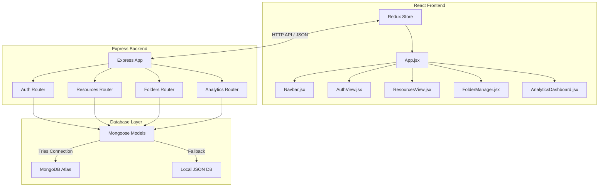

# 🎓 EduReach Network

EduReach Network is a modern **MERN (MongoDB, Express, React, Node.js)** web application designed to support offline-friendly and low-bandwidth educational resource sharing for educators and teachers. It empowers educators to publish, organize, download, and track the impact of worksheets, lesson plans, study guides, and activities.

---

## 🏗️ System Architecture

The application is structured as a decoupled monorepo containing a **React frontend** powered by **Vite** and **Redux Toolkit**, alongside a **Node.js/Express backend** connected to a **MongoDB database**. If a MongoDB instance is unavailable, the backend gracefully falls back to a local JSON-based mock database.



---

## ✨ Features

1. **User Authentication & Profiles**:
   - Secure signup and login for educators with authorization headers.
   - School affiliation association to highlight community engagement.
2. **Offline-friendly Resource Library**:
   - Sharing of lesson plans, worksheets, activities, and study guides.
   - Ability to download materials as lightweight text files formatted for low-bandwidth environments.
   - Categorized search and filters based on Subject, Category, and Grade Level.
3. **Structured Folder Management**:
   - Create directories/folders to catalog materials.
   - Share folders with specific permissions (read/write) with other teachers.
4. **Analytics Dashboard**:
   - Track key metrics such as total shared resources, active folders, registered educators, and total downloads.
   - Breakdowns by subject and category to visualize resource distribution.
   - Highlights of top-performing materials.

---

## 📂 Project Directory Structure

```text
Mern-project/
├── backend/                   # Node.js + Express Backend
│   ├── bin/www               # Application entry point
│   ├── config/db.js          # DB Connection & local DB fallback controller
│   ├── middleware/           # Custom backend middleware (auth validation)
│   ├── models/               # Mongoose Schema Definitions
│   │   ├── User.js
│   │   ├── Resource.js
│   │   ├── Folder.js
│   │   └── Student.js        # Legacy student management model
│   ├── routes/               # API Router Handlers
│   │   ├── auth.js
│   │   ├── resources.js
│   │   ├── folders.js
│   │   └── analytics.js
│   ├── mock_db.json          # File-based local database backup
│   ├── app.js                # Express app setup and middleware configuration
│   └── package.json          # Backend dependencies
│
└── frontend/                  # React + Vite Frontend
    ├── public/               # Public static assets
    ├── src/
    │   ├── components/       # Interface Views & Components
    │   │   ├── Navbar.jsx
    │   │   ├── AuthView.jsx
    │   │   ├── ResourcesView.jsx
    │   │   ├── FolderManager.jsx
    │   │   └── AnalyticsDashboard.jsx
    │   ├── store/            # Redux Toolkit Slices (State Management)
    │   │   ├── index.js
    │   │   ├── authSlice.js
    │   │   ├── resourceSlice.js
    │   │   ├── folderSlice.js
    │   │   └── analyticsSlice.js
    │   ├── App.jsx           # Main Core Tab Controller
    │   ├── index.css         # Styling system configuration
    │   └── main.jsx          # React app DOM mounting point
    └── package.json          # Frontend dependencies
```

---

## ⚙️ Environment Configuration

### Backend
Create a `.env` file inside the [backend/](file:///C:/Mern-project/backend/) folder:

```env
MONGO_URL=mongodb+srv://<username>:<password>@cluster.mongodb.net/database_name
PORT=5050
```

> [!NOTE]
> If `MONGO_URL` is unavailable or if standard DNS resolution fails on restricted networks, the application will fallback to using [backend/mock_db.json](file:///C:/Mern-project/backend/mock_db.json) dynamically to ensure uninterrupted local development.

---

## 🚀 API Endpoints

### Authentication: `/api/auth`
- `POST /api/auth/register` - Registers a new user.
- `POST /api/auth/login` - Logs in a user and returns a JWT/session token.
- `GET /api/auth/me` - Resolves the current authenticated user session.

### Resources: `/api/resources`
- `GET /api/resources` - Fetches and filters resources (accepts `search`, `subject`, `category`, `gradeLevel`).
- `POST /api/resources` - Shared/publishes a new educational material (requires Auth).
- `PUT /api/resources/:id` - Updates resource content/metadata (Owner only).
- `DELETE /api/resources/:id` - Deletes a resource (Owner only).
- `POST /api/resources/:id/download` - Increments download metric count.

### Folders: `/api/folders`
- `GET /api/folders` - Lists folders owned by or shared with the current authenticated user.
- `POST /api/folders` - Creates a new empty folder.
- `POST /api/folders/:id/resources` - Adds a resource reference to a folder.
- `POST /api/folders/:id/share` - Shares a folder with another registered educator.

### Analytics: `/api/analytics`
- `GET /api/analytics` - Computes system stats including total counts, downloads, category/subject distributions, and top materials.

---

## 💻 Running the Application

Follow these steps to spin up the MERN stack locally.

### Prerequisites
- Node.js installed on your machine.
- Optional: Running MongoDB instance or MongoDB Atlas account.

### 1. Start the Backend Server
Navigate to the backend directory, install packages, and start the app:

```bash
cd backend
npm install
npm start
```
This runs the API server at `http://localhost:5050` (or `PORT` specified in `.env`).

### 2. Start the Frontend Dev Server
In a new terminal window, navigate to the frontend directory, install packages, and spin up the developer server:

```bash
cd frontend
npm install
npm run dev
```
Open `http://localhost:5173` (or the URL outputted by Vite) in your browser.

---

## 🛠️ Code References

- **Backend Configuration**:
  - Main Express configuration: [backend/app.js](file:///C:/Mern-project/backend/app.js)
  - DB Engine: [backend/config/db.js](file:///C:/Mern-project/backend/config/db.js)
  - Port & Server entry point: [backend/bin/www](file:///C:/Mern-project/backend/bin/www)
- **Database Schemas**:
  - User model: [backend/models/User.js](file:///C:/Mern-project/backend/models/User.js)
  - Resource model: [backend/models/Resource.js](file:///C:/Mern-project/backend/models/Resource.js)
  - Folder model: [backend/models/Folder.js](file:///C:/Mern-project/backend/models/Folder.js)
- **Frontend Core**:
  - Global Entry point: [frontend/src/main.jsx](file:///C:/Mern-project/frontend/src/main.jsx)
  - View switcher: [frontend/src/App.jsx](file:///C:/Mern-project/frontend/src/App.jsx)
  - Redux central store: [frontend/src/store/index.js](file:///C:/Mern-project/frontend/src/store/index.js)
- **Interactive Views**:
  - Login / Signup UI: [frontend/src/components/AuthView.jsx](file:///C:/Mern-project/frontend/src/components/AuthView.jsx)
  - Library Grid UI: [frontend/src/components/ResourcesView.jsx](file:///C:/Mern-project/frontend/src/components/ResourcesView.jsx)
  - Folders UI: [frontend/src/components/FolderManager.jsx](file:///C:/Mern-project/frontend/src/components/FolderManager.jsx)
  - Analytics graphs and rankings: [frontend/src/components/AnalyticsDashboard.jsx](file:///C:/Mern-project/frontend/src/components/AnalyticsDashboard.jsx)